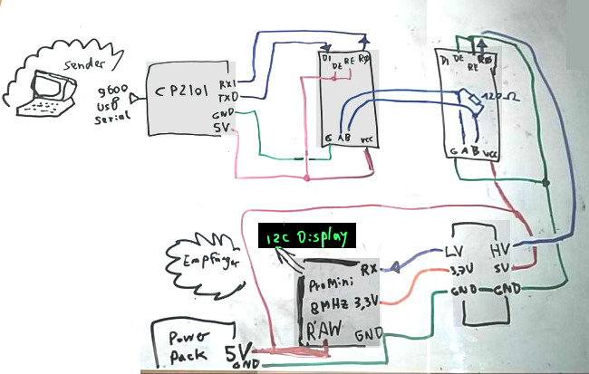

# RS 485 interface example

Transmit data to a oled 128x32 i2c display via a 2 wire very long cable with two RS485 modules.

## Circuit

- lipo power bank 5V
- 128x32 i2c display
- two RS-485 modules
- a low/high level shift module
- CP2102 USB uart interface
- 3.3V 8MHz arduino pro mini (or adafruit feather pro mini)

The i2c display needs a 3.3V wire (from the arduino pro mini), GND, and SDA (A4 pin)
and SCL (A5 pin).

## Protocol

You need a protocol to add more devices to the 2 wire bus system. You need it, because
you have to know how is talking to the 2 wires. A second point is, that you have
to set DE and RE to HIGH on the talking device, and set them to LOW on the
hearing devices.